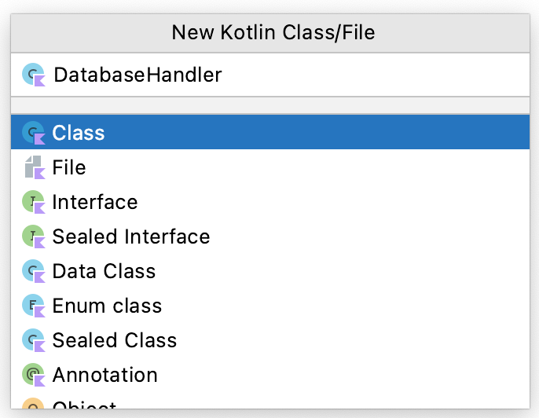

# Data persistence

Data persistence refers to the fact that data need to persist through app life cycle changes. In other words, even if you close the app completely the data need to be restored when the user navigates back to the app.

> The most common mistake people make when demonstrating data persistence is that they press the Home button when they finish saving data and then tap the app icon again to bring the app back. NO! That's NOT how you demonstrate data persistence! The proper way of doing it is, after saving your data, you close the app completely using app switcher e.g. the square button and then start your app again by tapping the icon. To understand why this is the case you need to remind yourselves about Activity Lifecycle.

## Lab 1 SharedPreferences and files

### SharedPreferences

SharedPreferences is a way to save simple key-value pairs. In fact, the file produced by SharedPreferences API is a plain xml file similar to the resource files you provide for the system. 

Follow steps below to prepare the layout xml file:

1. Start a new Android Studio project and name it 'MySharedPreferences'. In activity_main.xml, change the default layout to LinearLayout, add `android:orientation="vertical"`.
2. In the Design view, drag and drop the following items onto the layout, below the automatically generated 'Hello World' TextView, in the order of Plain Text, TextView, and Phone. All these three go below the 'Hello World' TextView that was  by the system. Rearrange the XML so it looks like below:

```xml
<?xml version="1.0" encoding="utf-8"?>
<LinearLayout xmlns:android="http://schemas.android.com/apk/res/android"
    xmlns:app="http://schemas.android.com/apk/res-auto"
    xmlns:tools="http://schemas.android.com/tools"
    android:layout_width="match_parent"
    android:layout_height="match_parent"
    android:orientation="vertical"
    tools:context=".MainActivity">

    <TextView
        android:id="@+id/name"
        android:layout_width="wrap_content"
        android:layout_height="wrap_content"
        android:text="Name"/>

    <EditText
        android:id="@+id/nameText"
        android:layout_width="match_parent"
        android:layout_height="wrap_content"
        android:ems="10"
        android:hint="Enter name here"
        android:inputType="textPersonName"/>

    <TextView
        android:id="@+id/phone"
        android:layout_width="match_parent"
        android:layout_height="wrap_content"
        android:text="Phone numer"/>

    <EditText
        android:id="@+id/phoneText"
        android:layout_width="match_parent"
        android:layout_height="wrap_content"
        android:ems="10"
        android:hint="Enter phone number here"
        android:inputType="textCapWords|phone"
        />

    <Button
        android:id="@+id/button"
        android:layout_width="wrap_content"
        android:layout_gravity="right"
        android:layout_height="wrap_content"
        android:text="Save"/>

</LinearLayout>
```


Next, let's need to use SharedPreferences API to save some simple data.

1. Open MainActivity.kt file and insert the following declarations immediately after the class declaration:
    
    ```kotlin
    companion object {
        const val NAME_KEY = "NAME_KEY"
        const val PHONE_KEY = "PHONE_KEY"
    }
    private var editTextName: EditText? = null
    private var editTextPhone: EditText? = null
    private var sharedPreferences: SharedPreferences? = null
    ```
    
    Code above initializes two EditText objects that hold the user inputs and two static strings which are going to be used as keys in the key-value pairs.
    
2. Modify the `onCreate()` method to match the following:
    
    ```kotlin
    override fun onCreate(savedInstanceState: Bundle?) {
        super.onCreate(savedInstanceState)

        setContentView(R.layout.activity_main_java)

        editTextName = findViewById<View>(R.id.nameText) as EditText
        editTextPhone = findViewById<View>(R.id.phoneText) as EditText
        sharedPreferences = getSharedPreferences("MySharedPreMain", MODE_PRIVATE)

        if (sharedPreferences!!.contains(NAME_KEY)) {
            editTextName!!.setText(sharedPreferences!!.getString(NAME_KEY, ""))
        }
        if (sharedPreferences!!.contains(PHONE_KEY)) {
            editTextPhone!!.setText(sharedPreferences!!.getString(PHONE_KEY, ""))
        }
    }
    ```
    
    There're several methods offered by the SharedPreferences class, here `contains()` and `getString()` methods are to test if the SharedPreferenes object contains specific keys. If it does, it will get the data out.
    
3. Create a call-back method that responds to the click event of the only button in the XML. Don't forget the `commit()` method, which is similar to `commit()` in FragmentTransaction. You also need to update the xml file to associate the button with this method by inserting `android:onClick="save"` line.
    
    ```kotlin
    fun save(v: View) {
        val editor = sharedPreferences!!.edit()
        editor.putString(NAME_KEY, editTextName!!.text.toString())
        editor.putString(PHONE_KEY, editTextPhone!!.text.toString())
        editor.commit()
        Toast.makeText(v.context, "data saved", Toast.LENGTH_SHORT).show()
    }
    ```
   
4. Run the app and type in something, then click the 'Save' button. Close the app properly (i.e. through app switcher) and then re-open you'll the data is still there.
    
    
    
    

### Writing and reading to files

1. Create a new project named 'MyFiles' (Empty Activity).
2. Open 'MyFiles' project, in activity_main.xml, update the userface with the XML code given.
3. Switch back to the design view, drag and drop another button to the right of the Save button, and a Plain TextView to the left of the Save button. Make your layout look like this:
    
    
    
4. Double click on the new button, change the text to Load, and id to load. 
5. Double click on the new TextView, delete the text so it becomes blank. Switch back to the text view and give this TextView a weight of 1, and width/height of '0dp'. The finished XML LinearLayout should look like below. 
    
    ```xml
    <?xml version="1.0" encoding="utf-8"?>
    <LinearLayout xmlns:android="http://schemas.android.com/apk/res/android"
        xmlns:app="http://schemas.android.com/apk/res-auto"
        xmlns:tools="http://schemas.android.com/tools"
        android:layout_width="match_parent"
        android:layout_height="match_parent"
        android:orientation="vertical"
        tools:context=".MainActivity">

        <TextView
            android:id="@+id/name"
            android:layout_width="wrap_content"
            android:layout_height="wrap_content"
            android:text="Name"/>

        <EditText
            android:id="@+id/nameText"
            android:layout_width="match_parent"
            android:layout_height="wrap_content"
            android:ems="10"
            android:hint="Enter name here"
            android:inputType="textPersonName"/>

        <TextView
            android:id="@+id/phone"
            android:layout_width="match_parent"
            android:layout_height="wrap_content"
            android:text="Phone numer"/>

        <EditText
            android:id="@+id/phoneText"
            android:layout_width="match_parent"
            android:layout_height="wrap_content"
            android:ems="10"
            android:hint="Enter phone number here"
            android:inputType="textCapWords|phone"
            />

        <LinearLayout
            android:layout_width="match_parent"
            android:layout_height="wrap_content"
            android:orientation="horizontal">

            <TextView
                android:id="@+id/textView"
                android:layout_width="0dp"
                android:layout_height="wrap_content"
                android:layout_weight="1"
                />

            <Button
                android:id="@+id/button"
                android:layout_width="wrap_content"
                android:layout_height="wrap_content"
                android:layout_gravity="right"
                android:onClick="save"
                android:text="Save"/>

            <Button
                android:id="@+id/load"
                android:layout_width="wrap_content"
                android:layout_height="wrap_content"
                android:text="Load"/>

        </LinearLayout>

    </LinearLayout>
    ```
    
    
    
7. Open MainActivity.kt file, in order to use file input/output, you need to declare some variables. The declaration goes together with EditeTexts' declaration
    
    ```kotlin
    companion object {
        const val FILE_NAME = "contacts.txt"
    }
    private var editTextName: EditText? = null
    private var editTextPhone: EditText? = null
    private var file: File? = null
    private var outputStream: FileOutputStream? = null
    private var inputStream: FileInputStream? = null
    ```
    
9. Inside the `onCreate()` method, update for loading UI and initializing the file object:
    
    ```kotlin
    override fun onCreate(savedInstanceState: Bundle?) {
        super.onCreate(savedInstanceState)
        setContentView(R.layout.activity_main_java_file)
        editTextName = findViewById<View>(R.id.nameText) as EditText
        editTextPhone = findViewById<View>(R.id.phoneText) as EditText
        file = File(this.filesDir, FILE_NAME)
    }
    ```
    
    This will create a new file at the system default location for your app with the given file name.
    
10. Modify the `save()` method, so it looks like below
    
    ```kotlin
    fun save(v: View?) {
        val data = editTextName!!.text.toString() + "|" + editTextPhone!!.text.toString()
        try {
            outputStream = FileOutputStream(file)
            outputStream!!.write(data.toByteArray())
            outputStream!!.close()
            Toast.makeText(this, "data saved", Toast.LENGTH_SHORT).show()
        } catch (e: Exception) {
            e.printStackTrace()
        }
    }
    ```
    
    What the code does here is to get texts in name and phone fields and join them using the character '|'. Which character to use is totally up to you, but you want some special characters i.e. those not often seen in names and phone numbers so that parsing data back is easier. Anything that concerns InputStream/OutputStream (FileInputStream/FileOutputStream are sub-classes) should be closed properly, and need to be enclosed within try/catch block.
    
11. Create a new method called `load()`, using the following lines of codes:
    
    ```kotlin
    fun load(v: View?) {
        val length = file!!.length().toInt()
        val bytes = ByteArray(length)
        try {
            inputStream = FileInputStream(file)
            inputStream!!.read(bytes)
            inputStream!!.close()
            val data = String(bytes)
            editTextName!!.setText(data.split("|").toTypedArray()[0])
            editTextPhone!!.setText(data.split("|").toTypedArray()[1])
            Toast.makeText(baseContext, "data loaded", Toast.LENGTH_SHORT).show()
        } catch (e: Exception) {
            e.printStackTrace()
        }
    }
    ```
    
    From the file object created earlier in the `onCreate()` method, it gets the total number of bytes. Using this number, it then defines an array to hold all bytes. And then it reads every byte in one go and convert them into a String so that to assign these texts to different widgets.
    
12. Open activity_main.xml file and associate this `load()` method with the Load button. Job done! 

Run this app in an AVD and type some info such as those in the screenshot below, and click save. Shut your app properly and re-open it, if you click the Load button your data will be retrieved. The same as in the Shared Preferences example, the file you saved can be found using the Device Monitor. You can pull the file onto your local hard drive to have a look at its contents.


## Lab 2 SQLite Databases

SharedPreferences and File storage are mainly used to store data of small quantity. If you have a large amount of data the chance is that you'll need to use SQLite database.

> Exercises in this section roughly follow [the official guide](https://developer.android.com/training/data-storage/sqlite.html) and [an online tutorial written by Ravi Tamada](http://www.androidhive.info/2011/11/android-sqlite-database-tutorial/). Be aware that Google recommends using [the Room persistence library](https://developer.android.com/training/data-storage/room/index.html) instead of SQLite.

### SQL in 5 minutes

For those of you who aren't familiar with SQL syntax, follow instructions below to finish a very simple exercise. If you 'are familiar with SQL, you can simply skip this section and move to the next one directly.

1. Click on the following link to go to [SQL Fiddle](http://sqlfiddle.com). Paste the following into the Schema Panel (left panel) and then click the Build Schema button
    
    ```sql
    DROP TABLE IF EXISTS contacts;
    CREATE TABLE contacts (
        id INT PRIMARY KEY     NOT NULL,
        name          TEXT    NOT NULL,
        age           INT,
        address       CHAR(50)
    );
    ```
    
    This will create a new table that has four columns, each of these columns has a pre-defined type. If you click the Browser button, and then click on the 'contacts (TABLE)' you'll see different columns and associated data types
    
    
    
2. Click on DDL Editor button to go back to Schema Panel again. Insert the following SQL statements **below** (append, NOT replace) what's in there already and hit Build Schema button. This will insert some rows into the table. 
    
    ```sql
    INSERT INTO contacts (id, name, age, address) VALUES (1, 'Paul', 22, 'Singer Hall');
    INSERT INTO contacts (id, name, age, address) VALUES (2, 'John', 23, 'Singer Hall');
    INSERT INTO contacts (id, name, age, address) VALUES (3, 'Ben', 23, 'Callice Court');
    ```
    
3. When you see texts 'Schema Ready' below the Schema panel, you can insert the following into the SQL panel (right panel), and then click Run SQL
    
    ```sql
    SELECT * FROM contacts;
    ```
    
    After completion, you will see the data rows you just inserted come back from the query. You can also run queries using the 'WHERE' clause such as `SELECT * FROM contacts WHERE id = 2;`
    
    
    
    <!-- Some of you experienced problems with SQL Fiddle lately e.g. the website is very slow. If that happens again, repeat above steps using [SQL Tryit Editor from W3Schools](http://www.w3schools.com/sql/trysql.asp?filename=trysql_delete), or try [Online SQL interpreter](https://kripken.github.io/sql.js/GUI/) as suggested by Adam Towse. -->

Have a play around and make sure you understand everything, as these are important for the following exercise. In case you want to know more, go to [W3Schools](http://www.w3schools.com/sql/) and click links on the left to read.

### The Contact class - the model

In the following exercise, you are going to build a contact app to save some basic info of other people. First of all, let's create our data model.

1. Start a new Android Studio project and name it 'My SQLite'.
2. Right-click in the Project tool window to create a new class, and name it Contact.
3. Modify your class to make it look like the following. You should automatically generate getters and setters instead of typing manually. You might need to 'Rearrange Code' after that.
    
    ```kotlin
    class Contact(var id: Int, var name: String, var phone: String)
    ```

### The layout file - the view

Next, you will need to create a layout to accommodate the data model. Open activity_main.xml, replace the default layout with LinearLayout and insert `android:orientation="vertical"`. Delete the default TextView and insert the following

```xml
<?xml version="1.0" encoding="utf-8"?>
<LinearLayout xmlns:android="http://schemas.android.com/apk/res/android"
    xmlns:app="http://schemas.android.com/apk/res-auto"
    xmlns:tools="http://schemas.android.com/tools"
    android:layout_width="match_parent"
    android:layout_height="match_parent"
    android:orientation="vertical"
    tools:context=".MainActivity">

    <TextView
        android:layout_width="wrap_content"
        android:layout_height="wrap_content"
        android:text="ID" />

    <EditText
        android:id="@+id/IDText"
        android:layout_width="match_parent"
        android:layout_height="wrap_content"
        android:hint="insert ID"
        android:inputType="number" />

    <TextView
        android:id="@+id/textView"
        android:layout_width="wrap_content"
        android:layout_height="wrap_content"
        android:text="Name" />

    <EditText
        android:id="@+id/nameText"
        android:layout_width="match_parent"
        android:layout_height="wrap_content"
        android:hint="insert name"
        android:inputType="textPersonName" />

    <TextView
        android:id="@+id/textView2"
        android:layout_width="wrap_content"
        android:layout_height="wrap_content"
        android:text="Phone" />

    <EditText
        android:id="@+id/phoneText"
        android:layout_width="match_parent"
        android:layout_height="wrap_content"
        android:hint="insert phone number"
        android:inputType="phone" />

    <Button
        android:id="@+id/save"
        android:layout_width="wrap_content"
        android:layout_height="wrap_content"
        android:layout_gravity="right"
        android:onClick="save"
        android:text="Save" />

</LinearLayout>
```

### The DB handler and activity - the controller

Once you have the model and view, you will need to work on how to link both together (i.e. controller in MVC). This is probably the most challenging part in terms of app development. However, for SQLite databases, Android provides a helper class i.e. SQLiteOpenHelper that is very handy to use.

1. Create a new class called DatabseHandler extending SQLiteOpenHelper
    
    
    
    ```kotlin
    class DatabaseHandler : SQLiteOpenHelper {

    }
    ```
    
2. If you move your mouse over the red highlighted class declaration you'll see that you need to implement some abstract methods in order to inherit. Insert the following codes into the class to implement the two abstract methods.
    
    ```kotlin
     override fun onCreate(db: SQLiteDatabase) {
        db.execSQL("CREATE TABLE contactTable (colID, colName, colPhone)")
    }

    override fun onUpgrade(db: SQLiteDatabase, oldVersion: Int, newVersion: Int) {}
    ```
    
3. What you'll see now is that even though you have implemented the two abstract methods, there's still an error saying no constructor available. Click Code ==> Generate... ==> Constructor, in the window that pops up select the first option (the one with fewer inputs). This will generate a constructor for you.
    
    ```kotlin
    constructor(context: Context?, name: String?, factory: CursorFactory?, version: Int) : super(
            context,
            name,
            factory,
            version
        ) {
    }
    ```
    
    There're four parameters that are passed on to super constructor. The first one is the current context and the second is the database name. The 3rd parameter is an SQLiteDatabase.CursorFactory. The last parameter is the database version, where most likely you'll want it to be 1. This auto-generated constructor is overwhelming as you don't need all those info for such a simple app. Replace it with the following simplified version:
    
    ```kotlin
    constructor(context: Context?) : super(context, "testDB", null, 1) {}
    ```
    
4. By now all error messages (i.e. red underline highlights) should disappear, but still the `onCreate()` method is empty. Insert code into the method so it looks like the following:

    ```kotlin
    override fun onCreate(db: SQLiteDatabase) {
        db.execSQL("CREATE TABLE contactTable (colID, colName, colPhone)")
    }
    ```
    
    Here 'col' means column, but it can be anything as it's just a name. Note that this way of creating the table is very simple - just one line of code without declaring data type. However, there're many different ways to create tables in SQLite. Detailed instruction of this can be found on [the official SQLite documentation](https://www.sqlite.org/lang_createtable.html). 
    
5. In order to have a functional storage, you need to read/write to it. In terms of SQL database, this is commonly referred to as CRUD i.e. create, read, update, and delete. Insert the following method into the DatabaseHandler class
    
    ```kotlin
    fun addContact(contact: Contact) {
        val sqLiteDatabase = writableDatabase
        val contentValues = ContentValues()
        contentValues.put("colID", contact.id)
        contentValues.put("colName", contact.name)
        contentValues.put("colPhone", contact.phone)
        val result = sqLiteDatabase.insert("contactTable", null, contentValues)
        if (result > 0) {
            Log.d("dbhelper", "inserted successfully")
        } else {
            Log.d("dbhelper", "failed to insert")
        }
        sqLiteDatabase.close()
    }
    
    fun loadContacts(): ArrayList<Contact> {
        val sqLiteDatabase = readableDatabase
        val list: ArrayList<Contact> = ArrayList<Contact>()
        val c = sqLiteDatabase.rawQuery("SELECT * FROM contactTable", null)
        while (c.moveToNext()) {
            val colID = c.getString(0)
            val colName = c.getString(1)
            val colPhone = c.getString(2)
            val contact = Contact(colID.toInt(), colName, colPhone)
            list.add(contact)
        }
        return list
    }
    ```
    
    The method above will insert data into the database. ContentValues is very similar to Bundle - both are used to store key-values pairs. But Bundle is associated with Intent and used to pass data in between activities. ContentValues is mainly for database insertion/updating etc. People are suggesting that ContentValues is a special case of Bundle, see [discussions on Stack Overflow](http://stackoverflow.com/questions/9334470/is-there-an-efficient-way-to-convert-from-bundle-to-contentvalues). Also note here what comes back from insertion is the row id if it's successful or '-1' if it failed.
    
6. Now let's work on the MainActivity to link everything together. Open MainActivity.java file and declare these variables after class declaration.

    ```kotlin
    private var idText: EditText? = null
    private var nameText: EditText? = null
    private var phoneText: EditText? = null
    ```
    
    Insert variable initializations in `onCreate()` method

    ```kotlin
    idText = findViewById<View>(R.id.IDText) as EditText
    nameText = findViewById<View>(R.id.nameText) as EditText
    phoneText = findViewById<View>(R.id.phoneText) as EditText
    ```

    Next, create a `save()` method. You should also associate this method with the 'save' button in activity_main.xml.

    ```kotlin
    fun save(v: View?) {
        val anID = idText!!.text.toString().toInt()
        val aName = nameText!!.text.toString()
        val aPhone = phoneText!!.text.toString()
        val db = DatabaseHandler(this)
        db.addContact(Contact(anID, aName, aPhone))
    }
    ```

If you run this app in an AVD and insert some texts and click save, what you'll see is that there's a log entry produced:


`'. .'`'. .'`'. .'`'. .'`'. .'`'. .'`'. .'`'. .'`'. .'`'. .'(a beautiful divider)
   `     `     `     `     `     `     `     `     `     `


### Verify the results

Challenge, Try to use the loadContacts with ListView and CustomArrayAdapter to show a list of saved contact with a new activity named ListContactActivity.
