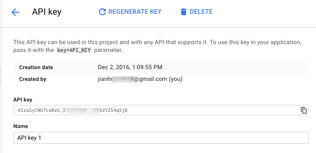
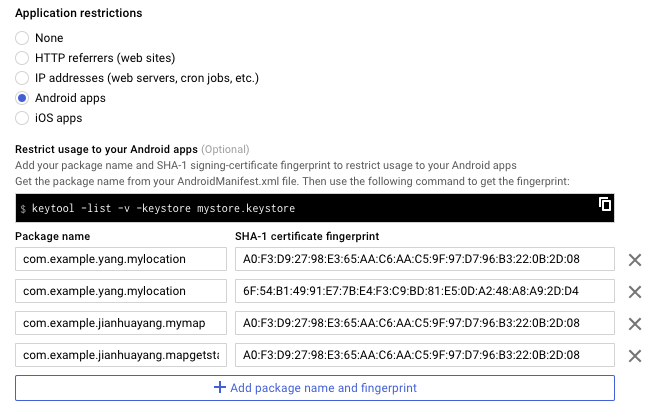

# Location Services and Google Maps

Most, if not all, Android devices have built-in sensors such as motion sensors to detect screen orientation and position sensors to detect your current position. Among many sensors that are available, the most widely used one is the location sensor.

## Lab 1 Location Services

There are different ways of determining an Android device's location. Two widely used APIs are the built-in Android location (android.location) and the Google Play services. The Google Play services location APIs, which are part of Google Play Services, are preferred over the Android framework location APIs (android.location) as it offers simpler interfaces and better battery usage.

In the following exercise, we’ll use the Google Play services location APIs to create an app that is capable of determining a device's location. In addition, the app can interpret the device's location in terms of latitude/longitude and turn it into a meaningful address.

### The app

Follow steps below to download the sample app from module's GitHub page and run it on your own machine.

> The demo project is a remix and simplified version of several official Android samples on [Making Your App Location-Aware
](https://developer.android.com/training/location/index.html)

1. Make sure Google play service is available on your system. In Android Studio, click Tools ==> Android ==> SDK Manager, this will bring up the Preference tool window Android SDK settings page. Make sure that Google Play services are installed.
    
    
    
2. Create a Project Named MyLocation with Empty Activity.
    
    Add the following dependency in build.gradle(app)
    ```
    implementation 'com.google.android.gms:play-services-location:19.0.1'
    ```

### Source code

In following sections, some important concepts used in the demo app are explained. More importantly, the sample project is well documented. You should study the source code carefully and read comments. You should also try and change some source code to explore and see what different functions the altered software offers.

__Get the permission__

The app needs to access the device's location. There're two parts to get this done:

1. First of all, declare 'uses-permission' in manifest file, contained within the `manifest` tag
    
    ```xml
    <uses-permission android:name="android.permission.ACCESS_FINE_LOCATION"/>
    <uses-permission android:name="android.permission.ACCESS_COARSE_LOCATION"/>
    ```
    
    Set the activity_main.xml
    ```xml
    <?xml version="1.0" encoding="utf-8"?>
    <RelativeLayout
    xmlns:android="http://schemas.android.com/apk/res/android"
    xmlns:app="http://schemas.android.com/apk/res-auto"
    xmlns:tools="http://schemas.android.com/tools"
    android:layout_width="match_parent"
    android:layout_height="match_parent"
    android:paddingBottom="16dp"
    android:paddingLeft="16dp"
    android:paddingRight="16dp"
    android:paddingTop="16dp"
    tools:context=".MainActivity">
        <TextView
            android:layout_width="match_parent"
            android:layout_height="wrap_content"
            android:text="Latitude:"/>

        <TextView
            android:id="@+id/latitude_text"
            android:layout_width="wrap_content"
            android:layout_height="wrap_content"
            android:layout_marginLeft="10dp"
            android:layout_marginStart="10dp"
            android:layout_marginTop="12dp"
            android:text="latitude"
            android:textIsSelectable="true"
            android:textSize="16sp"/>

        <TextView
            android:layout_width="match_parent"
            android:layout_height="wrap_content"
            android:layout_marginTop="48dp"
            android:text="Longitude:"/>

        <TextView
            android:id="@+id/longitude_text"
            android:layout_width="wrap_content"
            android:layout_height="wrap_content"
            android:layout_marginLeft="10dp"
            android:layout_marginStart="10dp"
            android:layout_marginTop="72dp"
            android:text="longitude"
            android:textIsSelectable="true"
            android:textSize="16sp"/>

        <TextView
            android:layout_width="match_parent"
            android:layout_height="wrap_content"
            android:layout_marginTop="96dp"
            android:text="Time:"/>

        <TextView
            android:id="@+id/time_text"
            android:layout_width="wrap_content"
            android:layout_height="wrap_content"
            android:layout_marginLeft="10dp"
            android:layout_marginStart="10dp"
            android:layout_marginTop="120dp"
            android:text="time"
            android:textIsSelectable="true"
            android:textSize="16sp"/>

        <LinearLayout
            android:layout_width="wrap_content"
            android:layout_height="wrap_content"
            android:layout_marginTop="144dp"
            android:orientation="horizontal">

            <Button
                android:layout_width="wrap_content"
                android:layout_height="wrap_content"
                android:onClick="onStartClicked"
                android:text="on/off"/>

            <Button
                android:id="@+id/locate"
                android:layout_width="wrap_content"
                android:layout_height="wrap_content"
                android:onClick="onLocateClicked"
                android:text="Locate"/>

        </LinearLayout>

        <TextView
            android:id="@+id/output"
            android:layout_width="match_parent"
            android:layout_height="match_parent"
            android:layout_marginTop="200dp"
            android:gravity="top"
            android:text="output area"/>

    </RelativeLayout>
    ```
    Enable Jetifier at gradle.properties
    ```
    android.useAndroidX=true
    android.enableJetifier=true
    ```
    
    
2. In MainActivity.kt, set the following variables:
    ```kotlin
    // member views
    protected var mLatitudeText: TextView? = null
    protected var mLongitudeText: TextView? = null
    protected var mTimeText: TextView? = null
    protected var mOutput: TextView? = null
    protected var mLocateButton: Button? = null

    // member variables that hold location info
    protected var mLastLocation: Location? = null
    protected var mLocationRequest: LocationRequest? = null
    protected var mGeocoder: Geocoder? = null
    protected var mLocationProvider: FusedLocationProviderClient? = null
    
    companion object {
        var REQUEST_LOCATION = 1
    }
    ```    

3. In MainActivity.kt, define the LocationCallback Objects:
    ```kotlin
    var mLocationCallBack: LocationCallback = object : LocationCallback() {
        override fun onLocationResult(result: LocationResult) {
            mLastLocation = result.lastLocation
            mLatitudeText!!.text = mLastLocation!!.latitude.toString()
            mLongitudeText!!.text = mLastLocation!!.longitude.toString()
            mTimeText!!.text = DateFormat.getTimeInstance().format(Date())
        }
    }
    ```    
    
4. In MainActivity.kt, add the following into onCreate function after setContentView:
    ```kotlin
    // initialize views
        mLatitudeText = findViewById<View>(R.id.latitude_text) as TextView
        mLongitudeText = findViewById<View>(R.id.longitude_text) as TextView
        mTimeText = findViewById<View>(R.id.time_text) as TextView
        mLocateButton = findViewById<View>(R.id.locate) as Button
        mOutput = findViewById<View>(R.id.output) as TextView

        // below are placeholder values used when the app doesn't have the permission
        mLatitudeText!!.text = "Latitude not available yet"
        mLongitudeText!!.text = "Longitude not available yet"
        mTimeText!!.text = "Time not available yet"
        mOutput!!.text = ""
        val locationPermissionRequest = registerForActivityResult(
            RequestMultiplePermissions(),
            ActivityResultCallback<Map<String?, Boolean?>> { result: Map<String?, Boolean?> ->
                val fineLocationGranted = result.getOrDefault(
                    Manifest.permission.ACCESS_FINE_LOCATION, false
                )
                val coarseLocationGranted = result.getOrDefault(
                    Manifest.permission.ACCESS_COARSE_LOCATION, false
                )
                if (fineLocationGranted != null && fineLocationGranted) {
                    // Precise location access granted.
                    // permissionOk = true;
                    mTimeText!!.text = "permission granted"
                } else if (coarseLocationGranted != null && coarseLocationGranted) {
                    // Only approximate location access granted.
                    // permissionOk = true;
                    mTimeText!!.text = "permission granted"
                } else {
                    // permissionOk = false;
                    // No location access granted.
                    mTimeText!!.text = "permission not granted"
                }
            }
        )
        locationPermissionRequest.launch(
            arrayOf(
                Manifest.permission.ACCESS_FINE_LOCATION,
                Manifest.permission.ACCESS_COARSE_LOCATION
            )
        )


        // LocationReques sets how often etc the app receives location updates
        mLocationRequest = LocationRequest()
        mLocationRequest!!.interval = 10
        mLocationRequest!!.fastestInterval = 5
        mLocationRequest!!.priority = LocationRequest.PRIORITY_HIGH_ACCURACY
    ```

How Android system handles permission has changed. The old way was to require all permissions upon installation. And the new way is to require individual permission on first use.


6. In MainActivity.kt, implement the onStartClicked function
    
    ```kotlin
   
    mLocationProvider = LocationServices.getFusedLocationProviderClient(this)
    mTimeText!!.text = "Started updating location"
        mLocationProvider!!.requestLocationUpdates(
            mLocationRequest!!,
            mLocationCallBack, Looper.getMainLooper()
        )
    ```
 
 6. In MainActivity.kt, implement the onLocateClicked function
    
    ```kotlin
   
    mGeocoder = Geocoder(this)
        try {
            // Only 1 address is needed here.
            val addresses = mGeocoder!!.getFromLocation(
                mLastLocation!!.latitude, mLastLocation!!.longitude, 1
            )
            if (addresses.size == 1) {
                val address = addresses[0]
                val addressLines = StringBuilder()
                //see herehttps://stackoverflow
                // .com/questions/44983507/android-getmaxaddresslineindex-returns-0-for-line-1
                if (address.maxAddressLineIndex > 0) {
                    for (i in 0 until address.maxAddressLineIndex) {
                        addressLines.append(
                            """
    ${address.getAddressLine(i)}
    
    """.trimIndent()
                        )
                    }
                } else {
                    addressLines.append(address.getAddressLine(0))
                }
                mOutput!!.text = addressLines
            } else {
                mOutput!!.text = "WARNING! Geocoder returned more than 1 addresses!"
            }
        } catch (e: Exception) {
        }
    ```
    


7. Get the permission. Run the app on an AVD (preferably not a real device, as you'll need to mock locations later), the first screen you'll see is something like below. These are really placeholders.
    
    
    
    Now if you click On/Off button, it'll ask your permission to access device location. Click Allow.
    
    
    
8. Simulate location changes in AVD. In the Extended controls window for AVD, in the Location tab, insert the following location for latitude and longitude respectively, 52.191064 and -1.707510, and click Send.
    
    
    
9. Determine current location and display Address. If you click the Locate button in the app you'll see that the above latitude/longitude corresponds to an address in Stratford (Shakespeare birthplace). If you then decide to mock a new location and send to the AVD, the app should pick this new location automatically for you.
    
    
    

## Lab 2 Google Maps

The first app allows you to manipulate devices' location without touching the actual Map. However, it'll be much nicer to see how the app interacts with the user on a real map. 

### Get started

Before moving to the next step, follow instructions here [Getting Started on Google Maps Android API](https://developers.google.com/maps/documentation/android-api/start) to create your first 'Get started' app. 


Note in the above tutorial 'Step 4. Get a Google Maps API key', when you go to Google developer console to create a new project, the default project name is also 'My Project'. If that name annoys you too, it can be changed through Google Cloud Platform page, on the right-hand-side under Project settings.


Take a note of the API key you created, you'll need it for later.



Also, note the default restrictions. If your app needs to use the API, it's fingerprint has to appear in the table.



### The app

Uninstall any MyLocation apps on your AVD/devices if exists. Download our demo project MyMap and replace the contents of google_maps_api.xml with the key you generated in 'Get started' project. Run this project and you'll see that on the first load, the app looks like below


In AVD Extended controls window, set the initial location to be 38.6347 and -90.2941 for latitude and longitude respectively, click Send. Next, download [a sample GPX file from Geovative](http://www.geovative.com/GeoToursWebApp/DownloadFile.aspx?vq=JD2QD3JVBAUEBGEIFBQ8L7PURB92NJ&q190y1nqgB2r=Tck&y1tQ190y1nqgB2r=Tck&y1th5r4Vq=) and load it into AVD Extended controls window.


In the app, click On/Off button, this will start/stop the GoogleApiClient. This will also enable the other buttons. Click on Map Frag, which stands for map fragment. Then click on the green triangle in AVD Extended controls window to start GPS playback. You'll see that as mock location changes, the app draws polylines joining some (not all!) of its determined locations.


### Source code 

__Add a map__

The app shows you two ways to add a map to an app: one uses a fragment, the other uses a MapView. Special attentions need to be paid when using MapView as one needs to [forward some activity lifecycle methods e.g. `onResume()`](https://developers.google.com/android/reference/com/google/android/gms/maps/MapView).

```java
//map using fragment
SupportMapFragment mapFragment = (SupportMapFragment) getSupportFragmentManager()
                .findFragmentById(mapFrag);
        mapFragment.getMapAsync(this);
```

```java
//map using mapview
mapView = (MapView) findViewById(R.id.mapFrag);
        mapView.onCreate(savedInstanceState);
        mapView.getMapAsync(this);
```

__Sync location data__

To synchronize location data from MainActivity to MapFragActivity, the app uses [the observer pattern](https://en.wikipedia.org/wiki/Observer_pattern). This is very similar to other OnXXListeners in the SDK.

> [Read Stack Overflow discussions on How to make listener to a custom variable](http://stackoverflow.com/questions/9879780/android-how-to-make-listener-to-a-custom-variable)

The MainActivity declares an interface, a member variable that belongs to that interface, and some actions this variable will take

```java
public interface OnCurrentLocationChangeListener {
    void onCurrentLocationChange(Location location);
}

static private OnCurrentLocationChangeListener mOnCurrentLocationChangeListener;

@Override
public void onLocationChanged(Location location) {
    mOnCurrentLocationChangeListener.onCurrentLocationChange(location);
}
```

Then, MapFragActivity implements that interface, and trace back the class and sets its listener

```java
public class MapFragActivity extends FragmentActivity implements MainActivity.OnCurrentLocationChangeListener {

MainActivity.setOnCurrentLocationChangeListener(this);

@Override
    public void onCurrentLocationChange(Location location) {
    }

```
